

   
  
   

 <h3><b>GreenStep</b></h3>
  플로깅 활동 기록, 쓰레기 데이터 & 쓰레기 배출 장소 제공, 경쟁과 업적을   
  통한 동기부여를 통해 환경보호 활동을 장려하는 서비스 
   삼성 청년 SW 아카데미</b>  
  2023.10.10 ~ 2023.11.06
   
  <a href="https://www.youtube.com/watch?v=kDpEdFLvfbg"> 
     
    UCC 보러가기
  </a>

# 👨‍👩‍👧‍👦 멤버

<table>
    <tr>
        <td height="140px" align="center"> <a href="https://github.com/nevermindperil">
                👑 송원규  (Front-End) </a>  </td>
        <td height="140px" align="center"> <a href="https://github.com/gangins">
                🌊 강경인  (Front-End) </a>  </td>
        <td height="140px" align="center"> <a href="https://github.com/chosim-dvlpr">
            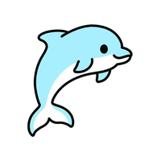    🔥 변민지  (Front-End) </a>  </td>
        <td height="140px" align="center"> <a href="https://github.com/ejuun">
                🌞 이주언  (Front-End) </a>  </td>
        <td height="140px" align="center"> <a href="https://github.com/c0mmedes">
                👻 이대경  (Back-End) </a>  </td>
        <td height="140px" align="center"> <a href="https://github.com/LeeSW-k">
                🌙 이상욱  (Back-End) </a>  </td>
    </tr>
</table>

 

# ⚙️ 아키텍쳐 및 기술 소개

<table>
    <tr>
        <td><b>Back-end</b></td>
        <td>
            
            
            
            
            
            
            
            
            
            
            
        </td>
    </tr>
    <tr>
        <td><b>Front-end</b></td>
        <td>
            
            
            
            
            
            
            
        </td>
    </tr>
    <tr>
        <td><b>Infra</b></td>
        <td>
            
            
            
            
            
            
        </td>
    </tr>
    <tr>
        <td><b>VC</b></td>
        <td>
            
            
            
              
        </td>
    </tr>
    <tr>
        <td><b>Tools</b></td>
        <td>
            
            
            
        </td>
    </tr>
</table>

 

# 🪓 시스템 아키텍처
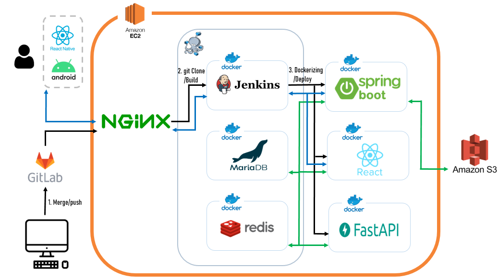
 
 

# 📚 ERD
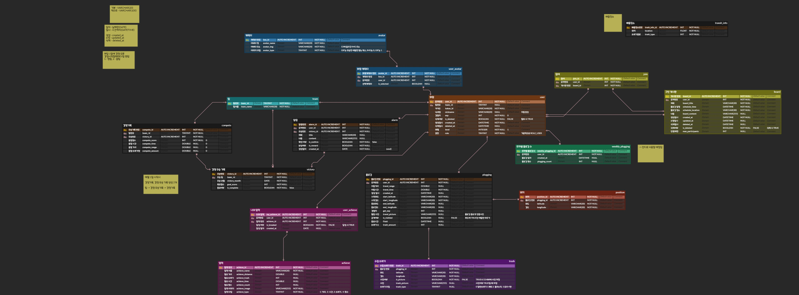
 
 

# 💻 기능 소개

## 메인
 
* 캐러셀을 통해 유저들이 올린 공개 인증 사진을 볼 수 있습니다.
* 모든 유저들의 플로깅 활동을 총합한 거리와 시간을 확인할 수 있습니다.
 

## 카카오 소셜 로그인
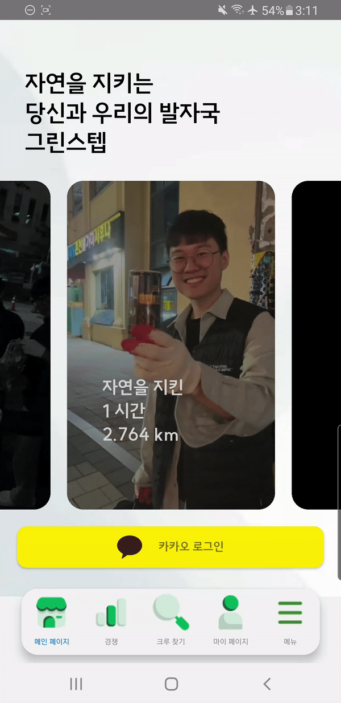 
* 메인 화면의 버튼을 통해 카카오 소셜 로그인이 가능합니다.
 

## 플로깅 시작하기
 
* 스타트 버튼을 길게 누르면 플로깅 기록 측정을 시작합니다.
* 플로깅시간, 플로깅 쓰레기 토탈 개수, 플로깅 거리를 측정합니다.
 

## AI 쓰레기 인식
 
* 인식할 쓰레기 사진을 촬영합니다.
* 인식한 결과 값을 바탕으로 해당하는 종류의 쓰레기 카운트 값을 상승시킵니다. 
 

## 배출장소조회
 
* 공공데이터를 기반으로 배출 장소의 위치를 가져옵니다. 
* 배출장소에 표현하는 이미지의 종류는 두 가지로 재활용 쓰레기통, 일반 쓰레기통이 있습니다.
* 버튼을 누르면 지도에 쓰레기통 이미지를 활용해서 배출장소의 위치를 나타냅니다. 
 

## 플로깅 종료
 
* 진행한 플로깅시간, 플로깅 쓰레기 토탈 개수, 플로깅 거리를 보여줍니다.
* 진행 내용을 바탕으로 경험치를 획득할 수 있습니다.
 

## 레벨업
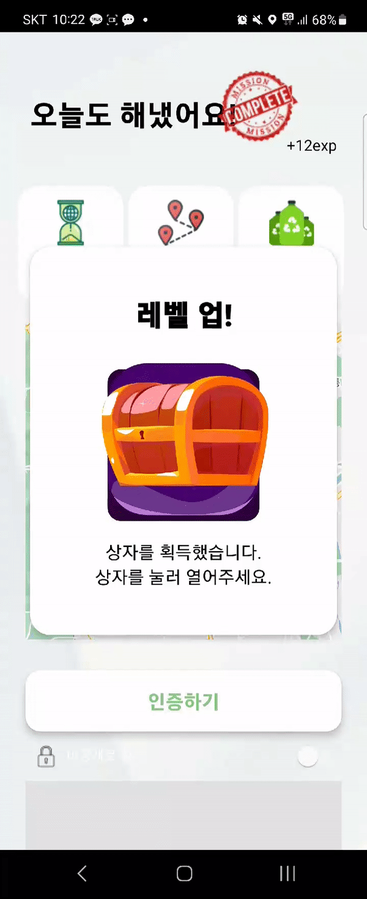 
* 플로깅을 통해 경험치를 얻게 되면, 레벨 업이 가능합니다.
* 레벨 업 시 랜덤 박스를 통해 랜덤 캐릭터를 얻을 수 있습니다.
 

## 플로깅 종료 후 인증사진 업로드, 공개여부 처리
 
* 종료 버튼을 눌러 플로깅을 종료하면 인증 사진을 업로드할 수 있습니다.
* 이 인증 사진은 메인페이지 피드로 사용됩니다.
* 비공개 설정 토글을 통해 공개 / 비공개 여부를 선택할 수 있습니다. 
 

## 경쟁
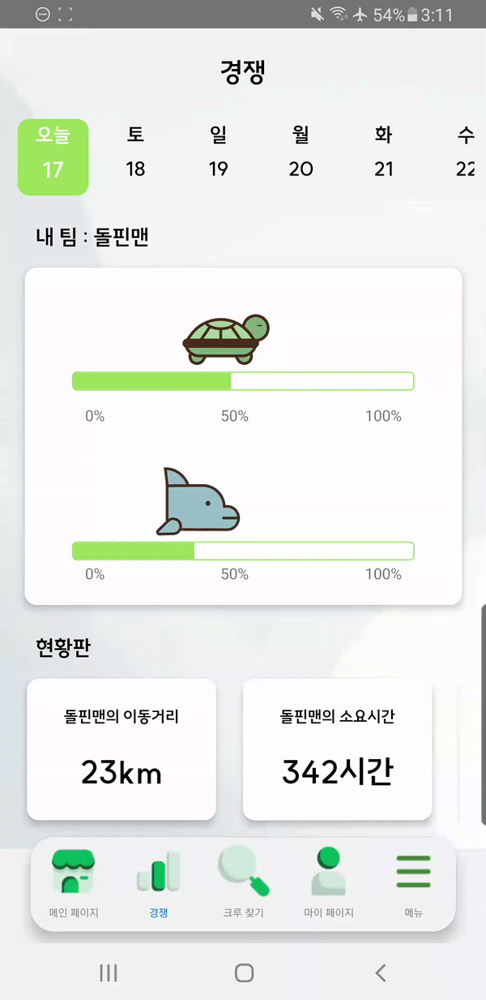 
* 경쟁 페이지에서는 사용자가 속한 팀을 확인할 수 있습니다.
* 두 팀의 진척도가 시각적으로 표시됩니다.
* 현황판에는 소속 팀의 총 이동거리, 총 플로깅 시간, 그리고 총 쓰레기 수집량이 표시됩니다.
* 한 팀이 최대 점수에 도달하면 경쟁이 종료됩니다.
 

## 경쟁 종료
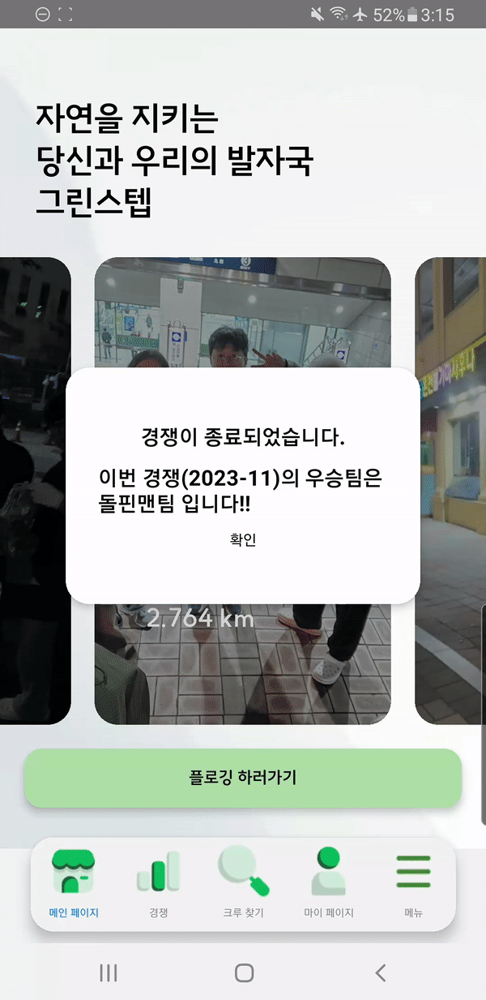 
* 한 팀이 최대 점수에 도달하면 경쟁이 종료되고, 해당 팀의 사용자들은 팀 경쟁에서만 얻을 수 있는 특별 상자를 획득합니다. 
* 특별 상자를 개봉하면 레어 프로필 캐릭터를 획득할 수 있습니다.
 

## 업적
 
* 거리, 시간,  주운 쓰레기 수, 횟수에 따른 업적을 통해 사용자의 지속적인 참여를 유도합니다.
* 각 업적별로 진행률 확인이 가능 합니다.
* 뱃지의 색 변화를 통해 업적 달성 여부를 쉽게 확인 할 수 있습니다.
* 업적 달성시 진행률 100%와 함께 달성 날짜가 입력 됩니다.
 

## 플로깅 행사
 
* 같이 플로깅 할 크루를 모집하는 구인 게시판 역할을 담당합니다.
* 상단에는 내가 작성한 글 목록이 나타납니다.
* 하단에는 전체 글 목록을 스크롤을 통해 확인 할 수 있습니다.
* 하단 가운데 글 쓰기 버튼을 통해 크루 찾기 게시글을 작성할 수 있습니다.
 

## 플로깅 크루 만들기
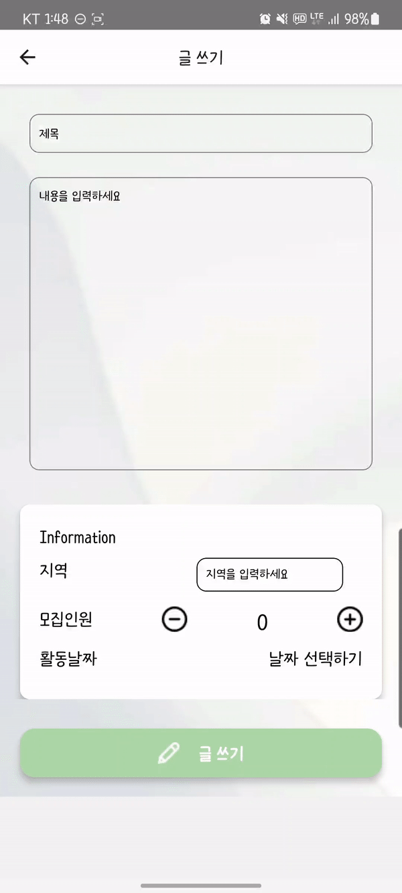 
* 게시판을 통해 플로깅 크루를 모집할 수 있는 글을 작성할 수 있습니다.
* 인원설정과 위치, 날짜를 설정할 수 있습니다.
 

## 플로깅 참여하기
 
* 해당 게시글의 제목, 내용, 플로깅 시작 날짜와 지역, 모집 인원을 확인 할 수 있습니다.
* 내가 작성한 글에서는 삭제하기 버튼을 통해 게시글을 삭제할 수 있습니다.
* 다른 사용자가 상세 게시글에 접근시 해당 글의 모집인원에 맞춰 참여하기 또는 탈퇴하기 버튼을 통해 플로깅에 참여 할 수 있습니다.
 

## 참여한 플로깅 조회
 
* 참여한 플로깅을 조회할 수 있으며 탈퇴하거나 다시 가입할 수 있습니다.
 

## 마이페이지
 

### 프로필
* 캐릭터 하단에 플로깅을 통해 성장한 LV이 표시가 됩니다.
* 캐릭터를 감싸고 있는 원형 바는 레벨업까지의 남은 경험치를 표시합니다.

### 내역
* 사용자가 진행했던 플로깅 내역들을 피드형태로 확인 할 수 있습니다.
* 목록에는 각 플로깅에서 진행한 시간, 거리, 주운 쓰레기 수가 표시되며 인증사진이 표시됩니다.
* 사진 클릭시 플로깅 상세 목록이 표시되며 실행 날짜, 얻은 경험치, 시간, 거리, 주운 쓰레기 수와 인증 사진의 정보가 보여집니다.

### 스트릭
* 선택 년도, 해당 주차에 진행한 플로깅 횟수를 알 수 있습니다.
* 스트릭은 좌우 스크롤을 통해 확인이 가능하며 박스 1개당 1주일에 해당합니다.
* 하단 횟수에 따른 색 표시로 해당 주차에 시행한 횟수를 알 수 있습니다.
 

## 캐릭터 선택
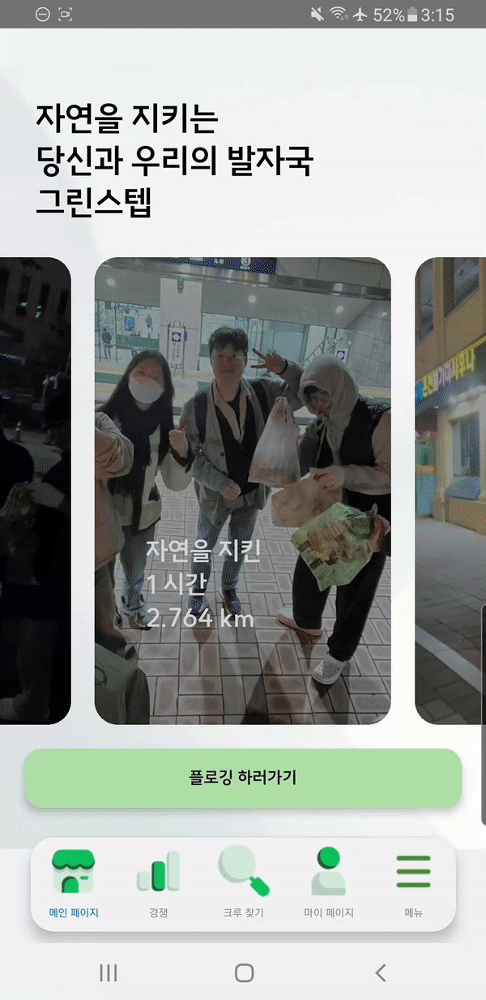 
* 플로깅과 경쟁을 통해 얻은 캐릭터 목록 중 선택하여 대표 캐릭터를 선정할 수 있습니다.
 

## 회원정보
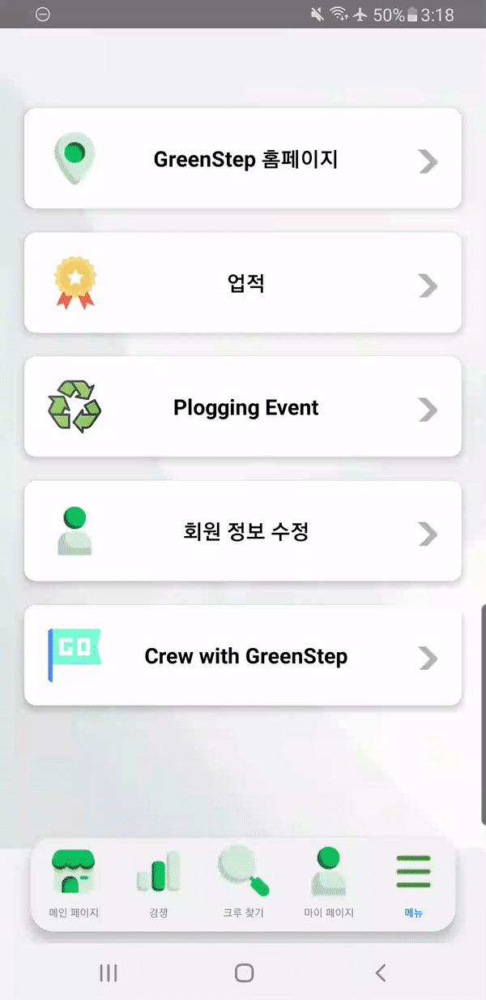 
* 임의로 제공되는 닉네임을 중복확인을 통해 변경 할 수 있습니다.
* 로그아웃 버튼을 통해 로그아웃 할 수 있습니다.
 

## 그린스텝 홈페이지

### 메인 페이지 
 
* 모든 유저의 플로깅 활동 내역(거리, 쓰레기 양, 시간)을 보여줍니다.
 

### 데이터맵 페이지
 
* 모든 유저의 플로깅 쓰레기 정보를 바탕으로 쓰레기 분포 지도를 표현합니다.
 

### 다운로드 페이지
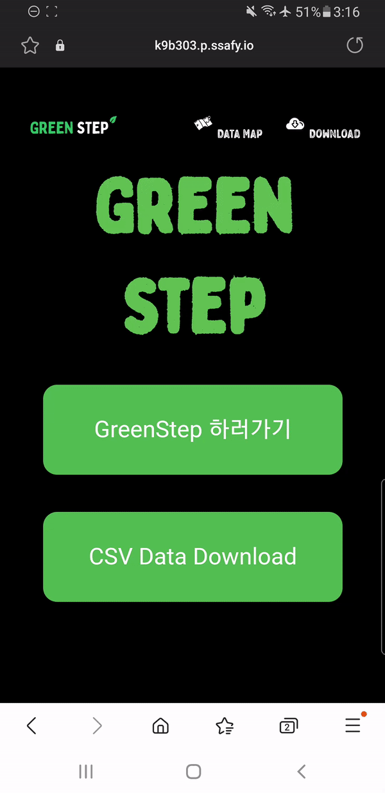 
* GreenStep 앱(.apk)과 플로깅 쓰레기 데이터 파일(.csv)을 다운로드 받을 수 있습니다.
 
