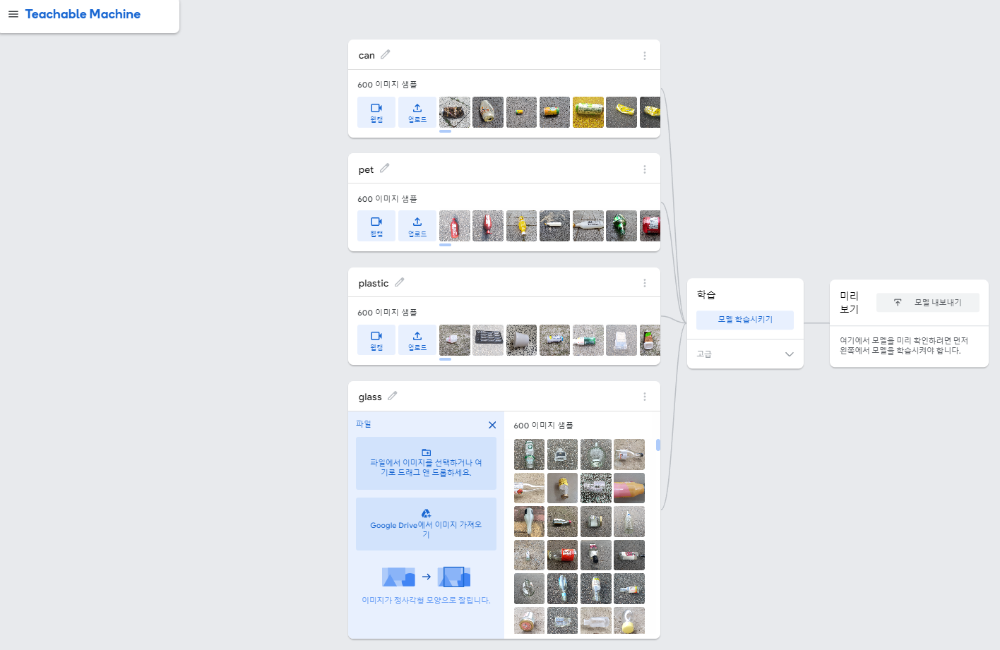

# AI



Teachable Machine으로 학습

클래스당 데이터셋 600장 (데이터셋 제공 → [https://www.aihub.or.kr/aihubdata/data/view.do?currMenu=&topMenu=&aihubDataSe=data&dataSetSn=71362](https://www.aihub.or.kr/aihubdata/data/view.do?currMenu=&topMenu=&aihubDataSe=data&dataSetSn=71362))


Spring Boot 서버와 별도의 Python 서버 간에 통신을 설정하여 TensorFlow 모델을 운영하는 것은 완전히 타당한 접근 방법입니다. 이렇게 하면 각 서버가 자신의 강점을 활용하여 작업을 수행할 수 있습니다. 예를 들어, Spring Boot는 웹 요청을 관리하고 비즈니스 로직을 처리하는 반면, Python 서버는 머신러닝 모델을 실행하는 데 사용됩니다.

하지만 이 접근 방법이 비효율적일 수 있는 몇 가지 이유는 다음과 같습니다:

1. **복잡성 증가**: 별도의 서버를 운영하면 시스템의 복잡성이 증가합니다. 이는 디버깅, 모니터링, 유지 관리가 더 어려워질 수 있음을 의미합니다.
2. **네트워크 지연**: 두 서버 간의 통신은 네트워크 지연을 추가하므로 응답 시간에 영향을 줄 수 있습니다.
3. **비용**: 두 개의 서버를 운영하면 호스팅 비용이 더 듭니다.
4. **리소스 관리**: 두 서버 모두에 대한 리소스(예: CPU, 메모리) 관리와 스케일링이 필요합니다.

이러한 문제를 피하기 위한 몇 가지 대안은 다음과 같습니다:

- **TensorFlow Serving**: TensorFlow Serving은 TensorFlow 모델을 서빙하기 위한 전용 시스템입니다. Spring Boot 서버에서 원격 호출을 통해 TensorFlow Serving API를 사용할 수 있습니다.
- **Java에서 TensorFlow 사용**: TensorFlow의 Java API를 사용하여 Spring Boot 애플리케이션 내에서 직접 모델을 실행할 수 있습니다. 이 경우 Python을 사용하는 것보다 성능이 떨어질 수 있지만, 시스템 복잡성을 크게 줄일 수 있습니다.
- **컨테이너화**: Docker 같은 컨테이너화 도구를 사용하여 Python 런타임과 모델을 하나의 서비스로 패키징하고 Spring Boot 서버와 함께 관리할 수 있습니다.

최종적으로, 이러한 구조는 개발 환경, 팀의 전문성, 필요한 성능 및 응답 시간 요구 사항, 그리고 운영 비용과 같은 요소들을 고려하여 결정해야 합니다.

TensorFlow 모델을 Python 서버에서 실행하고자 한다면 다음과 같은 방법으로 내보낼 수 있습니다:

- **TensorFlow (Keras)**: 만약 모델이 Keras API를 사용하여 생성되었다면, **`.h5`** 또는 Keras의 **`save`** 함수를 사용하여 모델을 저장할 수 있습니다. 이 방법은 Keras 모델을 간편하게 저장하고 로드하는데 적합합니다.
- **TensorFlow (SavedModel)**: TensorFlow의 SavedModel 형식은 TensorFlow 서빙을 포함한 다양한 서비스와 툴에 호환되는 포맷입니다. 이 형식은 모델의 구조와 가중치 뿐만 아니라 그래프도 저장하기 때문에 TensorFlow를 사용하여 모델을 배포하고자 할 때 일반적으로 권장됩니다.
- **TensorFlow Lite**: 모바일 또는 임베디드 디바이스에서 모델을 실행하고자 할 때 사용합니다. 이 형식은 모델 크기를 최소화하고 성능을 최적화하는 변환을 수행합니다.
- **TensorFlow.js**: 웹 브라우저나 Node.js 환경에서 실행하기 위한 형식입니다. 만약 모델을 웹 클라이언트에서 사용하고자 한다면 이 포맷을 선택하면 됩니다.

Python 서버를 띄워서 모델을 실행하려면, 일반적으로 **TensorFlow (SavedModel)** 형식이 가장 적합합니다. 이 형식은 TensorFlow 서빙과 호환되며, 다양한 플랫폼과 툴에서 널리 사용됩니다. TensorFlow Serving을 사용하여 모델을 서빙하고 REST API나 gRPC를 통해 Spring Boot 애플리케이션에서 호출할 수 있습니다.

**호스팅주소**

[https://teachablemachine.withgoogle.com/models/8-5duUYOu/](https://teachablemachine.withgoogle.com/models/8-5duUYOu/)

**TensorFlow (js)**

[tm-my-image-model.zip](AI_IMG/tm-my-image-model.zip)

**TensorFlow (SavedModel)**

**TensorFlow (Keras)**

[converted_keras (1).zip](AI_IMG/converted_keras_(1).zip)

캔, 페트, 플라스틱, 유리

종이, 스티로폼, 비닐 → 얘네를 일반으로 처리

각 학목당 1000장 학습돌리기

server를 springboot or python(flask, fast api?)

# Fast API

[https://parkjh7764.tistory.com/154](https://parkjh7764.tistory.com/154)

각각의 데이터 400장씩 추가, 기타데이터 etc(종이 스티로폼 비닐 건전지 형광등 각 240장)


```bash
from fastapi import FastAPI, File, UploadFile
import tensorflow as tf
import numpy as np
from io import BytesIO
from PIL import Image

app = FastAPI()

# 모델 경로를 지정합니다. 여기서는 'model'이라는 이름의 SavedModel 디렉토리로 가정합니다.
MODEL_PATH = 'model'

# TensorFlow 모델을 로드합니다.
model = tf.saved_model.load(MODEL_PATH)
print(model.signatures["serving_default"].structured_outputs)
print("testetest")

@app.post("/predict-image/")
async def predict_image(file: UploadFile = File(...)):
    contents = await file.read()
    pil_image = Image.open(BytesIO(contents))

    # 이미지를 모델에 맞게 전처리합니다.
    pil_image = pil_image.resize((224, 224))
    img_array = np.array(pil_image) / 255.0
    img_array = img_array[np.newaxis, ...]  # 배치 차원 추가

    # 모델을 사용하여 예측을 수행합니다.
    # `predict` 함수는 `tf.keras.Model`에 대해 사용되는데, `tf.saved_model.load`로 로드된 모델은 이를 직접 사용할 수 없습니다.
    # 대신, 서빙 시그니처를 사용해야 합니다.
    # 모델을 사용하여 예측을 수행합니다.
    img_tensor = tf.convert_to_tensor(img_array, dtype=tf.float32)  # 데이터 타입을 float32로 명시
    predictions = model.signatures["serving_default"](img_tensor)

    # 예측 결과를 처리합니다.
    predicted_class = np.argmax(predictions['sequential_3'].numpy(), axis=1)
    confidence = np.max(predictions['sequential_3'].numpy(), axis=1)

    return {"predicted_class": int(predicted_class[0]), "confidence": float(confidence[0])}

# 참고: `serving_default`는 모델을 훈련할 때 설정한 서빙 시그니처에 따라 달라질 수 있습니다.
```

**가상환경설정**

```bash
python -m venv myenv
```

**가상환경활성화**

CMD

```bash
myenv\Scripts\activate
```

**서버실행**

```bash
uvicorn main:app --reload
```

 ****

**포트 호스트 변경**

```bash
uvicorn main:app --host 0.0.0.0 --port 5000
```