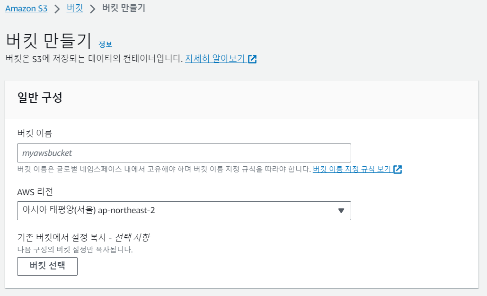

# AWS S3

[AWS console](https://s3.console.aws.amazon.com/s3/get-started?region=ap-northeast-2) 이동

버킷만들기



버킷이름 입력(본인 프로젝트명이라던지)


차단해제

버킷만들기


생성된 버킷 선택 후 권한 탭 이동


버킷 정책에서 편집 클릭

버킷 ARN 복사 후 정책 생성기 클릭


- Type of Policy: S3 Bucket Policy
- principal: *
- Actions: *로 모든 기능 허용, 필요한 기능만 지정도 가능
- ARN: 복사해둔 bucket ARN

Add Statement > Generete Policy → 생성된 정책 복사

```yaml
{
    "Version": "2012-10-17",
    "Id": "Policy1698930675210",
    "Statement": [
        {
            "Sid": "Stmt1698930655476",
            "Effect": "Allow",
            "Principal": "*",
            "Action": "s3:*",
            "Resource": "arn:aws:s3:::3mm/*"
        }
    ]
}
```

정책 복사 후 변경 사항 저장

**IAM (Identity and Access Management) 추가**

S3에 접근하기 위해서는 IAM 사용자에게 S3 접근 권한을 줘야합니다.

검색창에 IAM 검색 후 들어간 다음 사용자 클릭


사용자 생성 클릭


사용자 이름 입력 후 다음


말 그대로 S3에 대한 모든 권한을 소유한다는 의미

태그는 선택사항이라 그냥 넘어가고 사용자 생성까지 클릭

생성된 사용자 누르고 액세스 키 만들기 선택


설명 태그 선택사항이라 그냥 넘어가고 액세스 키 만들기 누르면 끝

엔진엑스 해놨을 시에 사이즈열어놔야됨

```yaml
http {
        # Set client upload size - 100Mbyte
        client_max_body_size 10M;
```

yaml

```yaml
aws:
  s3:
    bucketName: 
  accessKey: 
  secretKey: 
  region: ap-northeast-2

spring:
  servlet:
    multipart:
      max-file-size: 10MB
      max-request-size: 10MB
```

yaml에 등록 후 사용하면 됨
