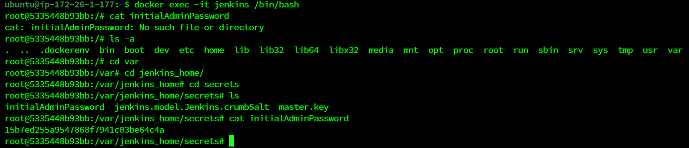
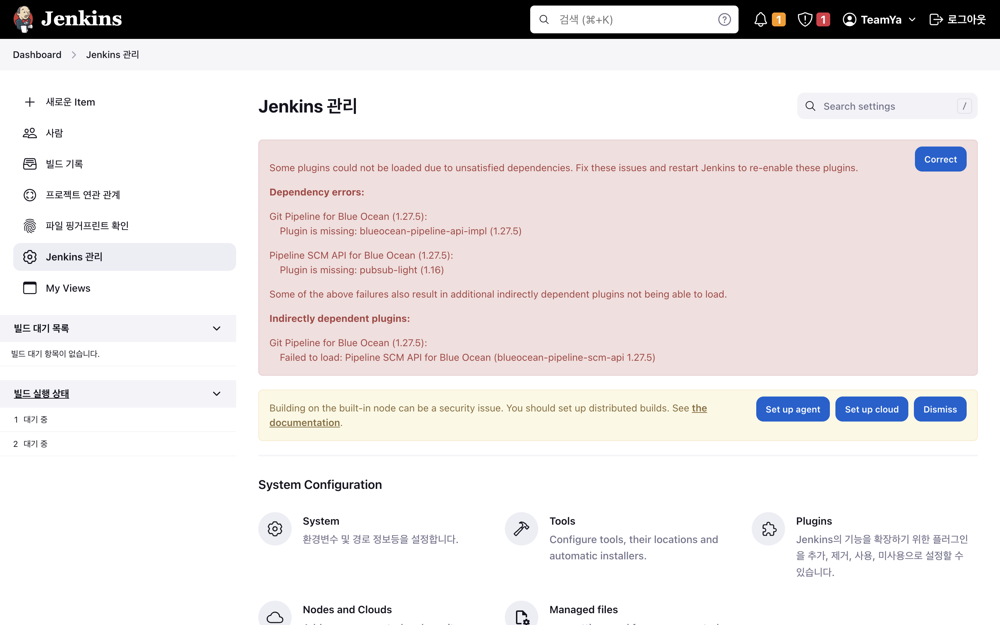
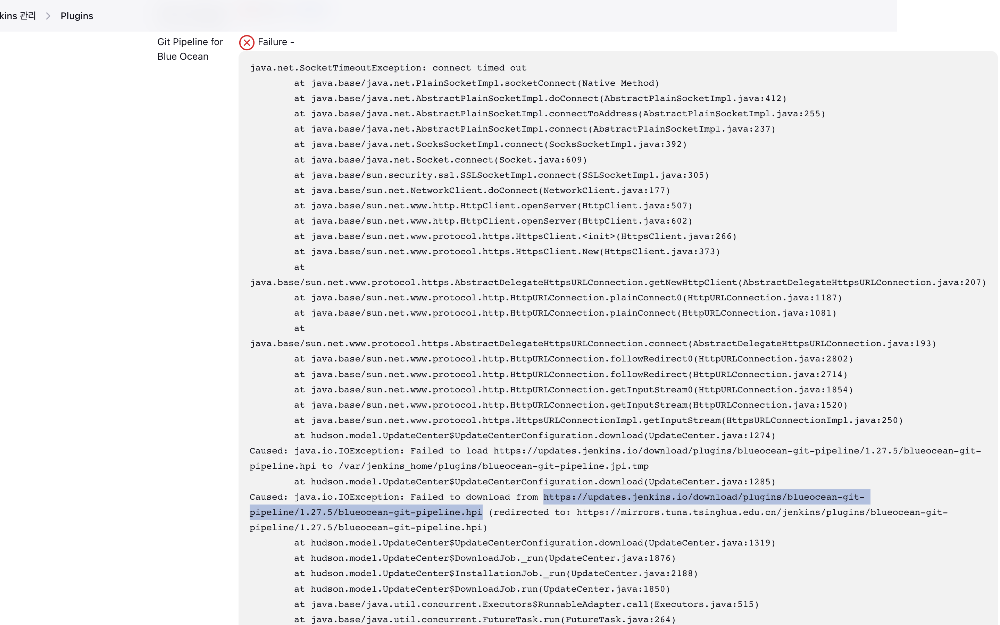
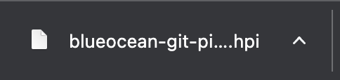
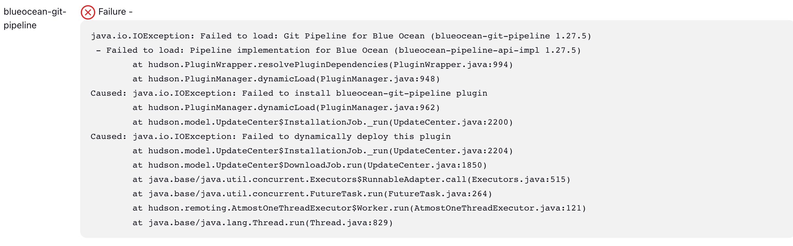

# Jenkins

## Jenkins

### Docker compose로 Jenkins 설치

```yaml
version: '3'
  
services:
        jenkins:
                image: jenkins/jenkins:lts
                container_name: jenkins
                volumes:
                        - /var/run/docker.sock:/var/run/docker.sock
                        - /jenkins:/var/jenkins_home
                ports:
                        - "9090:8080"
                user: root
```

- jenkins 추가 후

```bash
version: "3"
  
services:
  db:
    image: mariadb:10
    ports:
      - "3306:3306"
    container_name: mariadb
    volumes:
      - ./db/conf.d:/etc/mysql/conf.d
      - ./db/data:/var/lib/mysql
      - ./db/initdb.d:/docker-entrypoint-initdb.d
    environment:
      MARIADB_ROOT_PASSWORD: wkdbf303
    restart: always

  jenkins:
    image: jenkins/jenkins:lts
    container_name: jenkins
    volumes:
      - /var/run/docker.sock:/var/run/docker.sock
      - /jenkins:/var/jenkins_home
    ports:
      - "9090:8080" 
    user: root
```

```bash
sudo docker compose up -d
```

젠킨스 버전 확인

```bash
docker inspect [JENKINS_IMAGE_NAME_OR_ID] --format '{{ index .Config.Labels "jenkins.version"}}'
# docker inspect 7d9f27c219f9 --format '{{ index .Config.Labels "jenkins.version"}}'
```

### 실행 중인 컨테이너 내에서 터미널 사용

```bash
docker exec -it [JENKINS_CONTAINER_ID_OR_NAME] /bin/bash
docker exec -it 7d9f27c219f9 /bin/bash
```

- **`exec`**: 실행 중인 컨테이너에서 명령어를 실행하는 명령어
- **`-it`**: "interactive"와 "tty"의 옵션을 동시에 사용한 것으로, 터미널과 상호 작용할 수 있도록 컨테이너와 상호 연결하고, 터미널 입력을 가능하게 합니다.
- **`/bin/bash`**: 컨테이너 내부에서 실행할 명령어로, 이 경우 "/bin/bash"를 실행하여 shell 세션을 시작

### Jenkins에 있는 초기 비밀번호 꺼내기

- 컨테이너의 터미널에 접속
- var/jenkins_home/secrets 하위에 있는 initialAdminPassword
- Jenkins 로그인 시 사용

```bash
docker exec 젠킨스컨테이너ID cat /var/jenkins_home/secrets/initialAdminPassword
```



336876d5561849c99fa57e66669f5bff

### Jenkins 초기 화면

- 지정한 도메인에 접근 시(여기에서는 8444 포트로 접근)
- 꺼낸 초기 비밀번호 입력


- 왼쪽의 Install suggest plugins 클릭


- 하단의 `skip and continue as admin` 클릭


<aside>
❓ 계정명 : greenstep

암호 : wkdbf303(자율303)

</aside>

- 기본으로 설정된 URL 확인 후 `save and finish` 클릭


- Jenkins 기본 화면


### 오류 발생한 Plugin Install

메인 → Jenkins 관리 → Plugins → Available plugins

> Jenkins를 다시 설치하는 것이 더 빠르고 좋을 수도
> 



- 필요한 plugin 검색 후 `install without restart`로 설치


- 다운로드 중 3가지 상태
    - 성공
    - 대기중
    - 실패 → Details 클릭하기!!


- `.hpi`로 끝나는 주소 복사해 크롬 주소 입력창에 입력하면 직접 다운로드 진행





- 그런 링크가 없다면 skip



### 직접 Plugin 설치

Jenkins 관리 → Plugins → Advanced settings → Deploy Plugin


- 파일선택 → 다운받은 `.hpi` 파일 선택 후 Deploy 클릭 → 설치 완
- 아쉽게도 파일은 하나씩만 가능
- Deploy 후 Jenkins 재부팅 필요

### Jenkins Node.js

> Node.js의 npm은 프론트 프로젝트를 build하는데 필수적인 요소
> 

- Jenkins plugin 설치

Jenkins 관리 → Plugin → Available plugins → NodeJS 검색 후 설치

- Global tool 등록
    - Jenkins 관리 → Tools →


`name` : Jenkinsfile에서 사용할 이름

`Version` : Node 버전 선택

- Jenkinsfile 설정

```java
pipeline {
    agent any

    tools{
        nodejs 'nodejs-20.6.1'
    }
}
```

## Jenkins 내부 Docker

### Jenkins Container의 terminal로 이동

```yaml
sudo docker exec -it jenkins bin/bash
```

### Docker 설치

docker 관련 패키지를 Ubuntu리눅스 시스템에 설치하기 위한 일련의 명령어 실행

```yaml
# 필요한 패키지 설치
$ apt-get install ca-certificates curl gnupg lsb-release

# Docker 패키지 인증하는데 사용하는 디렉토리 생성
$ mkdir -p /etc/apt/keyrings

# Docker의 공식 GPG키 다운로드 -> /etc/apt/keyrings/docker.gpg에 저장
$ curl -fsSL https://download.docker.com/linux/debian/gpg | gpg --dearmor -o /etc/apt/keyrings/docker.gpg

# Docker APT저장소를 설정하는 줄 생성, /etc/apt/sources.list.d/docker.list파일에 저장
# 이 저장소를 통해 Docker패키지를 설치 가능
$ echo \
  "deb [arch=$(dpkg --print-architecture) signed-by=/etc/apt/keyrings/docker.gpg] https://download.docker.com/linux/debian \
  $(lsb_release -cs) stable" | tee /etc/apt/sources.list.d/docker.list > /dev/null

# APT패키지 관리자의 패키지 목록을 업데이트
$ apt-get update

# Docker와 관련된 패키지를 설치
$ apt-get install docker-ce docker-ce-cli containerd.io docker-compose-plugin
```

<aside>
❓ Jenkins 컨테이너 안에서 Docker명령어를 사용하기 위해서 설정해줘야함

</aside>


- script
    
    ```
    pipeline {
        agent any 
        
        environment {
            CONTAINER_NAME = "greenstep-container"
            IMAGE_NAME = "greenstep-image"
        }
    
        stages {
            stage('Git Clone') {
                steps {
                    git branch: 'back-release', credentialsId: 'wook', url: 'https://lab.ssafy.com/s09-final/S09P31B303.git'
                    sh "docker images"
                }
            }
            
            stage('Build') {
                steps {
                    sh '''
                        pwd
                        echo 'springboot build'
                        cd ./greenstep
    					cp /var/jenkins_home/backend-config/application.yml /var/jenkins_home/workspace/back/greenstep/src/main/resources
                        chmod +x ./gradlew
                        ./gradlew clean build -x test
                    '''
                }
            }
            
            stage('Docker delete') {
                steps {
                    script {
                        try {
                            sh "docker stop ${CONTAINER_NAME}"
                            sh "docker rm -f ${CONTAINER_NAME}"
                        } catch (Exception e) {
                            echo "Docker container ${CONTAINER_NAME} does not exist. Skipping deletion."
                        }
                        
                        try {
                            sh "docker image rm ${IMAGE_NAME}"
                        } catch (Exception e) {
                            echo "Docker image ${IMAGE_NAME} does not exist. Skipping deletion."
                        }
                    }
                }
                
                post {
                    success { 
                        sh 'echo "docker delete Success"'
                    }
                    failure {
                        sh 'echo "docker delete Fail"'
                    }
                }
            }
    
            stage('Dockerizing'){
                steps{
                    sh 'echo " Image Build Start"'
                    sh """
                        cd ./greenstep
                        ls -la
                        docker build -t ${IMAGE_NAME} . 
                    """
                }
                post {
                    success {
                        sh 'echo "Build Docker Image Success"'
                    }
                    failure {
                        sh 'echo "Build Docker Image Fail"'
                    }
                }
            }
    
            stage('Deploy') {
                steps {
                    sh "docker run --name ${CONTAINER_NAME} -d -p 8081:8080 ${IMAGE_NAME}"
                }
                post {
                    success {
                        echo 'deploy success'
                    }
                    failure {
                        echo 'deploy failed'
                    }
                }
            }
        }
    }
    ```
    
    이 Jenkins 파이프라인은 크게 5개의 주요 단계(**`Git Clone`**, **`Build`**, **`Docker delete`**, **`Dockerizing`**, **`Deploy`**)로 구성되어 있습니다. 아래에 각 단계별로 설명하겠습니다.
    
    1. **Pipeline Setup**
        - **`agent any`**: Jenkins 빌드를 실행할 agent를 지정합니다. **`any`**는 사용 가능한 모든 agent 중 아무거나 선택하라는 뜻입니다.
        - **`environment`**: 환경 변수를 설정합니다. 여기서는 Docker 컨테이너와 이미지의 이름을 정의합니다.
    2. **Git Clone Stage**
        - 소스코드를 Git 저장소에서 클론합니다.
        - **`git branch: 'test/be/chatremove', credentialsId: 'asdasd', url: ...`**: 특정 branch에서 git repository를 클론합니다. **`credentialsId`**는 Jenkins에서 사전에 설정된 Git 인증 정보를 지정합니다.
        - **`sh "docker images"`**: 현재 도커에 있는 이미지 리스트를 출력합니다.
    3. **Build Stage**
        - 프로젝트를 빌드합니다.
        - **`cd ./backend/singstreet`**로 프로젝트 디렉토리로 이동하고, Gradle 빌드 도구를 사용하여 프로젝트를 빌드합니다. **`x test`**는 테스트를 제외하고 빌드를 수행합니다.
    4. **Docker delete Stage**
        - 기존에 실행 중인 도커 컨테이너와 이미지를 삭제합니다.
        - **`try-catch`** 구문을 사용하여 컨테이너나 이미지가 존재하지 않을 때 발생하는 예외를 처리합니다.
        - **`post`** 부분은 해당 단계가 성공했는지 실패했는지에 따라 추가 작업을 수행합니다.
    5. **Dockerizing Stage**
        - 프로젝트를 Docker 이미지로 만듭니다.
        - Dockerfile을 기반으로 도커 이미지를 빌드합니다.
    6. **Deploy Stage**
        - 빌드한 Docker 이미지를 실행하여 컨테이너를 생성하고 실행합니다.
        - 컨테이너는 4050 포트와 8080 포트를 호스트와 바인딩하며, 컨테이너 내부에서는 8081 포트로 애플리케이션을 실행합니다.