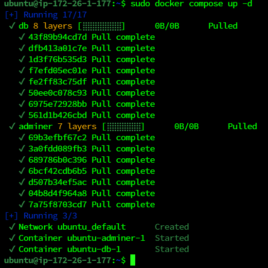

# MariaDB

### docker conmpose로 MySQL 설치

- docker-compose.yml 파일 수정

```bash
sudo vi docker-compose.yml
```

```bash
version: "3"

services:
  db:
    image: mariadb:10
    ports:
      - "3306:3306"
    volumes:
      - ./db/conf.d:/etc/mysql/conf.d
      - ./db/data:/var/lib/mysql
      - ./db/initdb.d:/docker-entrypoint-initdb.d
    environment:
      MARIADB_ROOT_PASSWORD: wkdbf303
    restart: always
```

## docker compose 실행

```bash
sudo docker compose up -d
```



- 확인

```bash
sudo docker ps -a
```


## MariaDB 접속

이 `docker exec`명령을 사용하면 실행 중인 컨테이너 내에서 명령을 실행할 수 있습니다. 

다음 명령줄은 `mariadb`컨테이너 내부에 bash 셸을 제공합니다.

```bash
$ sudo docker exec -it "CONTAINER ID" /bin/bash

# sudo docker exec -it ubuntu-db-1 /bin/bash
```

- root 계정 접속

```bash
mariadb -u root -p
```

`Enter password`는 docker-compose.yml에서 설정한 environment의 MYSQL_ROOT_PASSWORD의 값 입력

- 접속 성공


- 실패


## root 계정 접속 실패 시

### 실패

1. MySQL 이미지 삭제

```bash
# docker container 내리기
sudo docker stop "CONTAINER ID"

# docker 이미지 삭제
sudo docker rmi "IMAGE ID"
```

1. docker-compose.yml 파일 수정

`MYSQL_ROOT_PASSWORD`의 값 변경

> 하지만 docker compose 실행 시 마운트된 volume 파일 때문에 변경되지 않는다
> 

---

### 해결

- MySQL 삭제

```bash
sudo apt-get remove --purge mysql*
sudo rm -rf /etc/mysql /var/lib/mysql
sudo apt-get autoremove
sudo apt-get autoclean
```

- volume 파일 삭제

```bash
cd ~
cd data

# 관리자 권한
sudo su

# mysql 디렉토리 삭제
rm -r mysql
```

- docker-compose.yml 파일 변경 후 실행

## database 생성

- 마리아 DB 코드정리
    
    ```bash
    ## DB 접속
    mysql -u root -p
    mariadb -u root -p
    
    ## 계정 조회
    use mysql;
    select host, user, password from user;
    
    ## 계정 생성
    create user '계정'@localhost identified by '비밀번호';
    create user '계정'@'%' identified by '비밀번호';
    
    ## 권한 생성
    grant select on '스키마'.* to `계정`@`localhost` identified by '비밀번호';
    grant select on '스키마'.* to `계정`@`%` identified by '비밀번호';         
    
    ## 모든 권한 부여
    grant all privileges on '스키마.테이블' to '계정'@'localhost' identified by '비밀번호';
    grant all privileges on '스키마.테이블' to '계정'@'%' identified by '비밀번호';
    
    ## 수정사항 반영
    flush privileges;
    ```
    

```bash
$ create database "database이름";

# create database greenstep;
```

- 생성 확인

```bash
$ show databases;
```


## database의 admin 계정 생성

```bash
create user '아이디'@'호스트' identified by '비밀번호';

# create user 'greenstep_admin'@'%' identified by 'b303greenstep';
```

- % : 와일드카드 문자, 모든 호스트를 나타냄

### 계정 생성 확인

```bash
select user, host from user;
```

- user는 mysql(Database)에 있으므로
    - use mysql또는
    - select user, host from mysql.user;

### 권한 부여

```bash
grant all privileges on {DB shema}.{권한} to '아이디'@'호스트';

# grant all privileges on greenstep.* to 'greenstep_admin'@'%';
```

### 권한 조회

```bash
SHOW GRANTS FOR 'username'@'host';

# SHOW GRANTS FOR 'greenstep_admin'@'%';
```

### 권한 삭제

```bash
revoke all on test.* from 'jb'@'localhost';

# revoke all on billage.* from 'greenstep_admin'@'%';
```

### 변경 사항 저장

```bash
flush privileges;
```

## Workbench에서 MySQL 연결 테스트


`Connection Name` : tag 느낌

`Hostname` : 도메인 주소 **[k9b303.p.ssafy.io](mailto:ubuntu@k9b303.p.ssafy.io)**

`Username` : 권한을 준 아이디 **greenstep_admin**

`Port` : MySQL에 접근하는 포트 **3306**


