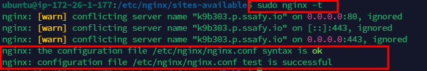

# Nginx

## Nginx

### 순서

1. Nginx 설치
2. Nginx 상태 변경
3. 환경 설정 (커스텀 config)
4. sites-enabled에 심볼릭 링크 생성
5. Nginx 제거
6. 완전 삭제

### Nginx 설치

```bash
$ sudo apt install nginx

$ sudo apt-get update
```

### Nginx 상태 변경

```bash
# 상태 확인
sudo systemctl status nginx

# 시작
sudo systemctl start nginx

# 재시작
sudo systemctl restart nginx

# 구성설정 변경
sudo systemctl reload nginx

# 중단
sudo systemctl stop nginx
```

### 환경 설정 (커스텀 config) - 3mm.conf

```bash
server {
  listen 80;
  server_name k9b303.p.ssafy.io;
  return 301 https://k9b303.p.ssafy.io$request_uri;
}

server {
  listen [::]:443 ssl http2;
  listen 443 ssl http2;
  server_name k9b303.p.ssafy.io;

  ssl_certificate /etc/letsencrypt/live/k9b303.p.ssafy.io/fullchain.pem;
  ssl_certificate_key /etc/letsencrypt/live/k9b303.p.ssafy.io/privkey.pem;
  include /etc/letsencrypt/options-ssl-nginx.conf;
  ssl_dhparam /etc/letsencrypt/ssl-dhparams.pem;

  location / {
    proxy_pass http://localhost:3000/;
    proxy_redirect off;
    charset utf-8;

    proxy_http_version 1.1;
    proxy_set_header Connection "upgrade";
    proxy_set_header Upgrade $http_upgrade;
    proxy_set_header Host $http_host;
  }

  location /jenkins {
    proxy_pass http://localhost:9090/;
  }

  location /api/ {
    proxy_pass http://localhost:8080/;
    proxy_redirect off;
    charset utf-8;

    proxy_http_version 1.1;
    proxy_set_header Connection "upgrade";
    proxy_set_header Upgrade $http_upgrade;
    proxy_set_header Host $http_host;
  }

  location /py/ {
    proxy_pass http://localhost:8000/;
    proxy_redirect off;
    charset utf-8;

    proxy_http_version 1.1;
    proxy_set_header Connection "upgrade";
    proxy_set_header Upgrade $http_upgrade;
    proxy_set_header Host $http_host;
  }
}
```

### sites-enabled에 심볼릭 링크 생성

- 인증서 적용을 위해 `sites-available` 와 `sites-enabled` 폴더를 연결하는 링크 필요
- 심볼릭 링크 : 특정 폴더에 링크를 걸어 원본 파일을 사용하기 위함

```bash
sudo ln -s /etc/nginx/sites-available/{파일명}.conf /etc/nginx/sites-enabled
# sudo ln -s /etc/nginx/sites-available/3mm.conf /etc/nginx/sites-enabled
```

`sites-enabled` 폴더에 8finance.conf가 자동으로 생성된 것을 확인할 수 있음

- 정상 실행 확인

```bash
sudo nginx -t
```



- 재시작

```bash
sudo systemctl reload nginx
```

- 오류1
    
    
    
    → Springboot의 포트를 열어 두지 않아 생기는 문제였음
    
    - 8080을 열어두고 5174?포트로 접속하라고 프록시 설정을 해서 나오는 문제였음!
    
- 오류2
    
    <aside>
    ❗ 모든 요청이 /login페이지로 이동하는 문제가 생김 (springboot)
    
    </aside>
    
    - test1. SpringSecurity 의존성 없애고 테스트

### Nginx 제거

```bash
# 설정 파일을 제외한 모든 파일 제거 
sudo apt-get remove nginx nginx-common 

# 모든 파일 제거 
sudo apt-get purge nginx nginx-common

#삭제 후 nginx 에서 사용하는 의존 모듈 삭제하기 
sudo apt-get autoremove
```

### 완전 삭제

- `/etc/nginx`까지 싹 다 지우려면

## 참고

- defalut

```bash
# 첫번째 서버 블록 (HTTP리디렉션)
# server블록은 HTTP트래픽을 HTTPS로 리디렉션 하는 역할을 함
# listen - HTTP트래픽을 받기위해 80번 포트로 대기하도록 지정

server {
        listen 80 default_server;
        listen [::]:80 default_server;

        # SSL configuration
        #
        # listen 443 ssl default_server;
        # listen [::]:443 ssl default_server;
        #
        # Note: You should disable gzip for SSL traffic.
        # See: https://bugs.debian.org/773332
        #
        # Read up on ssl_ciphers to ensure a secure configuration.
        # See: https://bugs.debian.org/765782
        #
        # Self signed certs generated by the ssl-cert package
        # Don't use them in a production server!
        #
        # include snippets/snakeoil.conf;

        root /var/www/html;

        # Add index.php to the list if you are using PHP
        index index.html index.htm index.nginx-debian.html;

        server_name _; # 모든 도메인 요청에 응답하는 기본 서버

        location / {
                # First attempt to serve request as file, then
                # as directory, then fall back to displaying a 404.
                try_files $uri $uri/ =404;
        }

        # pass PHP scripts to FastCGI server
        #
        #location ~ \.php$ {
        #       include snippets/fastcgi-php.conf;
        #
        #       # With php-fpm (or other unix sockets):
        #       fastcgi_pass unix:/var/run/php/php7.4-fpm.sock;
        #       # With php-cgi (or other tcp sockets):
        #       fastcgi_pass 127.0.0.1:9000;
        #}

        # deny access to .htaccess files, if Apache's document root
        # concurs with nginx's one
        #
        #location ~ /\.ht {
        #       deny all;
        #}
}

# Virtual Host configuration for example.com
#
# You can move that to a different file under sites-available/ and symlink that
# to sites-enabled/ to enable it.
#
#server {
#       listen 80;
#       listen [::]:80;
#
#       server_name example.com;
#
#       root /var/www/example.com;
#       index index.html;
#
#       location / {
#               try_files $uri $uri/ =404;
#       }
#}

# 두번째 서버 블록(HTTPS설정)
# HTTPS를 사용하여 도메인 "k9b303.p.ssafy.io"의 웹 사이트를 호스팅
# listen - 443번 포트로 대기하도록 설정하며, SSL/TLS 암호화를 활성화
# ssl_certificate 및 ssl_certificate_key는 Let's Encrypt로 발급받은 SSL 인증서 및 개인 키 파일의 경로를 지정

server {

        # SSL configuration
        #
        # listen 443 ssl default_server;
        # listen [::]:443 ssl default_server;
        #
        # Note: You should disable gzip for SSL traffic.
        # See: https://bugs.debian.org/773332
        #
        # Read up on ssl_ciphers to ensure a secure configuration.
        # See: https://bugs.debian.org/765782
        #
        # Self signed certs generated by the ssl-cert package
        # Don't use them in a production server!
        #
        # include snippets/snakeoil.conf;

        root /var/www/html;

        # Add index.php to the list if you are using PHP
        index index.html index.htm index.nginx-debian.html;
		    server_name k9b303.p.ssafy.io; # managed by Certbot

        location / {
                # First attempt to serve request as file, then
                # as directory, then fall back to displaying a 404.
                try_files $uri $uri/ =404;
        }

        # pass PHP scripts to FastCGI server
        #
        #location ~ \.php$ {
        #       include snippets/fastcgi-php.conf;
        #
        #       # With php-fpm (or other unix sockets):
        #       fastcgi_pass unix:/var/run/php/php7.4-fpm.sock;
        #       # With php-cgi (or other tcp sockets):
        #       fastcgi_pass 127.0.0.1:9000;
        #}

        # deny access to .htaccess files, if Apache's document root
        # concurs with nginx's one
        #
        #location ~ /\.ht {
        #       deny all;
        #}

    listen [::]:443 ssl ipv6only=on; # managed by Certbot
    listen 443 ssl; # managed by Certbot
    ssl_certificate /etc/letsencrypt/live/k9b303.p.ssafy.io/fullchain.pem; # managed by Certbot
    ssl_certificate_key /etc/letsencrypt/live/k9b303.p.ssafy.io/privkey.pem; # managed by Certbot
    include /etc/letsencrypt/options-ssl-nginx.conf; # managed by Certbot
    ssl_dhparam /etc/letsencrypt/ssl-dhparams.pem; # managed by Certbot

}

# return 301 https://$host$request_uri; :모든 HTTP요청을 HTTPS로 리디렉션
server {
    if ($host = k9b303.p.ssafy.io) {
        return 301 https://$host$request_uri;
    } # managed by Certbot

        listen 80 ;
        listen [::]:80 ;
    server_name k9b303.p.ssafy.io;
    return 404; # managed by Certbot

}
```

- 3mm.conf

```bash
server {
  listen 80;
  server_name k9b303.p.ssafy.io;
  return 301 https://k9b303.p.ssafy.io$request_uri;
}

server {
  listen [::]:443 ssl http2;
  listen 443 ssl http2;
  server_name k9b303.p.ssafy.io;

  ssl_certificate /etc/letsencrypt/live/k9b303.p.ssafy.io/fullchain.pem;
  ssl_certificate_key /etc/letsencrypt/live/k9b303.p.ssafy.io/privkey.pem;
  include /etc/letsencrypt/options-ssl-nginx.conf;
  ssl_dhparam /etc/letsencrypt/ssl-dhparams.pem;

  location / {
    proxy_pass http://localhost:3000/;
    proxy_redirect off;
    charset utf-8;

    proxy_http_version 1.1;
    proxy_set_header Connection "upgrade";
    proxy_set_header Upgrade $http_upgrade;
    proxy_set_header Host $http_host;
  }

  location /jenkins {
    proxy_pass http://localhost:9090/;
  }

  location /api/ {
    proxy_pass http://localhost:8080/;
    proxy_redirect off;
    charset utf-8;

    proxy_http_version 1.1;
    proxy_set_header Connection "upgrade";
    proxy_set_header Upgrade $http_upgrade;
    proxy_set_header Host $http_host;
  }

  location /py/ {
    proxy_pass http://localhost:8000/;
    proxy_redirect off;
    charset utf-8;

    proxy_http_version 1.1;
    proxy_set_header Connection "upgrade";
    proxy_set_header Upgrade $http_upgrade;
    proxy_set_header Host $http_host;
  }
}
```

- HTTP리디렉션 설정
    - `**listen 80;**`
        
        → HTTP트래픽을 80포트에서 수신
        
    - **`server_name k9b303.p.ssafy.io;`**
        
        → k9b303.p.ssafy.io도메인으로 들어오는 요청을 처리함
        
    - **`return 301 https://k9b303.p.ssafy.io$request_uri;`**
        
        → HTTP요청을 HTTPS로 리디렉션하는 역할
        
- HTTPS설정
    - **`listen [::]:443 ssl http2;`**와 **`listen 443 ssl http2;`**
        
        → HTTPS트래픽을 443에서 수신
        
- 프록시 설정
    - **`location /`**
        
        → 웹 루트로 들어오는 요청을 8080으로 프록시
        
    - **`location /jenkins/`**
        
        → /jenkins/경로로 들어오는 요청을 로컬 서버의 9090으로 프록시