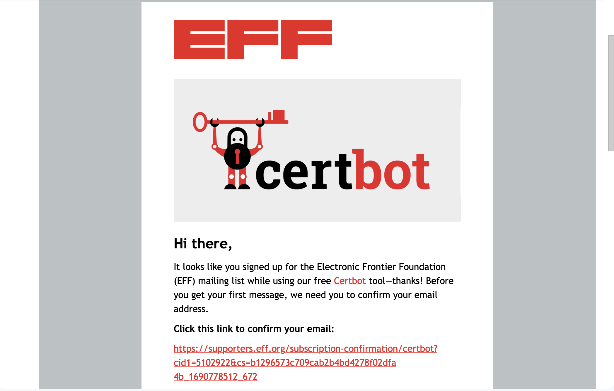
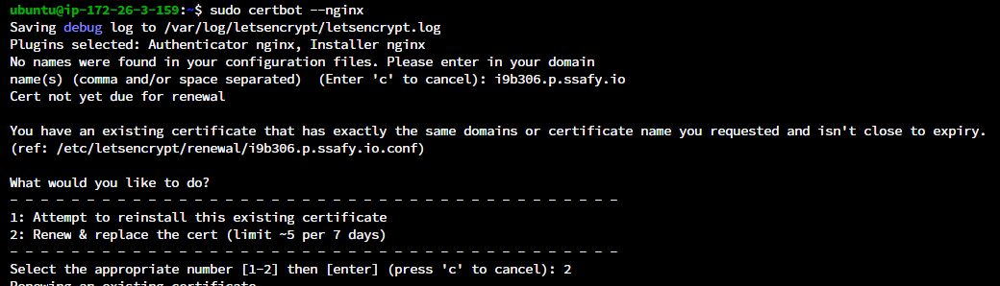

# Let’s Encrypt (SSL)

> Let’s Encrypt 는 보안 웹사이트를 위한 전송 계층 보안 암호화(SSL, TLS) 를 위해 무료로 인증서를 제공해주는 인증 기관이다.
인증서 발급 시 유효기간 (90일)이 존재한다.(갱신을 주기적으로 해줘야함)
> 

### 순서

1. Let’sEncrypt 설치
2. Certbot 설치
3. Certbot 실행 후 인증키 받기
4. Certbot 제거

### Let’sEncrypt 설치

```bash
$ sudo apt-get install letsencrypt

# 설치 후 명령어 실행 권고
$ sudo apt-get update
```

### Certbot 설치

```bash
sudo apt-get install certbot python3-certbot-nginx
```

- 실행

```bash
sudo certbot --nginx

certbot certonly --nginx -d <도메인 주소>
ex) certbot certonly --nginx -d j9b108.p.ssafy.io
```

```bash
Enter email address (used for urgent renewal and security notices) (Enter 'c' to
cancel): 메일 입력
- - - - - - - - - - - - - - - - - - - - - - - - - - - - - - - - - - - - - - - -
Please read the Terms of Service at
https://letsencrypt.org/documents/LE-SA-v1.2-November-15-2017.pdf. You must
agree in order to register with the ACME server at
https://acme-v02.api.letsencrypt.org/directory
- - - - - - - - - - - - - - - - - - - - - - - - - - - - - - - - - - - - - - - -
(A)gree/(C)ancel: A

- - - - - - - - - - - - - - - - - - - - - - - - - - - - - - - - - - - - - - - -
Would you be willing to share your email address with the Electronic Frontier
Foundation, a founding partner of the Let's Encrypt project and the non-profit
organization that develops Certbot? We'd like to send you email about our work
encrypting the web, EFF news, campaigns, and ways to support digital freedom.
- - - - - - - - - - - - - - - - - - - - - - - - - - - - - - - - - - - - - - - -
(Y)es/(N)o: Y

Which names would you like to activate HTTPS for?
- - - - - - - - - - - - - - - - - - - - - - - - - - - - - - - - - - - - - - - -
1: https 적용시키고 싶은 도메인 주소
- - - - - - - - - - - - - - - - - - - - - - - - - - - - - - - - - - - - - - - -
Select the appropriate numbers separated by commas and/or spaces, or leave input
blank to select all options shown (Enter 'c' to cancel):
Obtaining a new certificate
Performing the following challenges:
http-01 challenge for admin.flumeride.com
Waiting for verification...
Cleaning up challenges
Deploying Certificate to VirtualHost /etc/nginx/sites-enabled/default

Please choose whether or not to redirect HTTP traffic to HTTPS, removing HTTP access.
- - - - - - - - - - - - - - - - - - - - - - - - - - - - - - - - - - - - - - - -
1: No redirect - Make no further changes to the webserver configuration.
2: Redirect - Make all requests redirect to secure HTTPS access. Choose this for
new sites, or if you're confident your site works on HTTPS. You can undo this
change by editing your web server's configuration.
- - - - - - - - - - - - - - - - - - - - - - - - - - - - - - - - - - - - - - - -
Select the appropriate number [1-2] then [enter] (press 'c' to cancel): 2
Redirecting all traffic on port 80 to ssl in /etc/nginx/sites-enabled/default
```

- 이메일 인증위한 이메일 입력 후 직접 이메일에 들어가 인증을 진행해야함



### Certbot 실행 후 인증키 받기

1. 기존에 있는 곳에 재설치
2. 새로운 키 발급




### 인증키 확인

- `/etc/letsencrypt/live/j9b108.p.ssafy.io` 안에 인증 pem키 존재

```bash
# 관리자 권한으로 접급
sudo -s

##########terminal 같은 공간###############
root@ip-172-26-3-159:/# cd etc/letsencrypt/live/i9b306.p.ssafy.io/
root@ip-172-26-3-159:/etc/letsencrypt/live/i9b306.p.ssafy.io# ls

exit
```

### Certbot 제거

```bash
sudo apt remove certbot
```